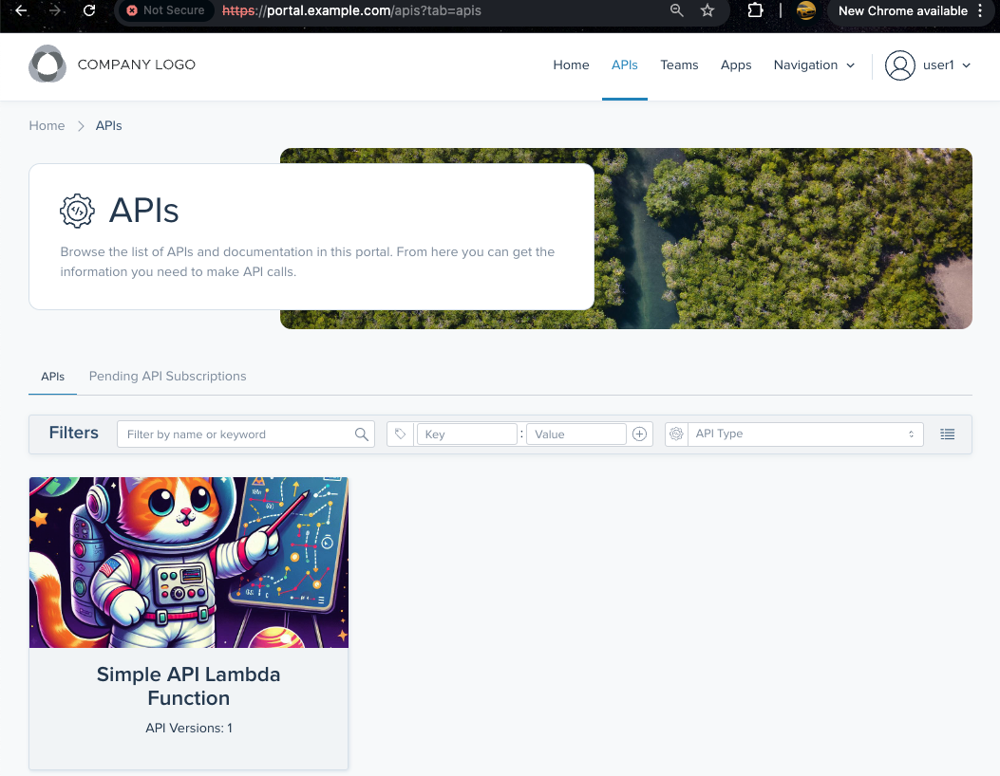
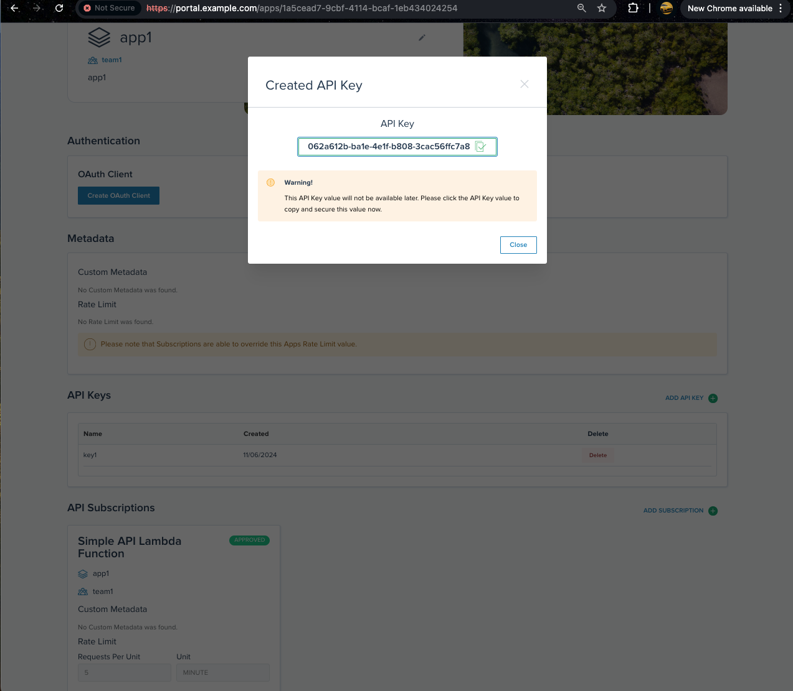

# Deploy Gloo Portal with an AWS Lambda service

This reference solution architecture demonstrate the process of onboarding an AWS Lambda function service to Gloo Portal. In addition, it shares the technique of using Gloo Gateway to wrap and expose the AWS Lambda function service as REST API service. Using Gloo Gateway to front AWS Lambda function is a common pattern in our customer base to save cost and reduce complexity, as well as levarage advanced application routing capabilities and security.
    
High-level workflow:
1. Deploy a KinD cluster
2. Deploy Keycloak as OIDC IdP   
3. Deploy Gloo Gateway with Gloo Portal
4. Deploy a gateway proxy and configure HTTP/HTTPS listeners
5. Deploy the sample AWS Lambda function service  
6. Create an `Upstream` for the Lambda function and expose it
7. Create a `VirtualHostOption` resource to transform Header's path and HTTP method into a JSON input for the AWS Lambda function upstream
8. Use `ApiSchemaDiscovery` to create an ApiDoc resource for the AWS Lambda function
9. Create an `ApiProduct` object (a bundle of APIs) targetting the `HTTPRoute`
10. Secure and expose the Gloo Portal backend
11. Deploy and expose the Gloo Portal frontend
12. Demonstrate the self service capabilities
13. Clean up AWS resources
    
    
#### 1. Deploy KinD cluster
```bash
export CLUSTER1=cluster1
./data/deploy.sh 1 $CLUSTER1
```

#### 2. Deploy Keycloak as OIDC IdP    
Install Postgres database for use by Keycloak
```bash
kubectl create namespace gloo-system
kubectl apply -f - <<EOF
apiVersion: v1
kind: ServiceAccount
metadata:
  name: postgres
  namespace: gloo-system
---
apiVersion: v1
kind: Secret
metadata:
  name: postgres-secrets
  namespace: gloo-system
type: Opaque
data:
  POSTGRES_DB: ZGI=
  POSTGRES_USER: YWRtaW4=
  POSTGRES_PASSWORD: YWRtaW4=
---
apiVersion: v1
kind: PersistentVolumeClaim
metadata:
  name: postgres-pvc
  namespace: gloo-system
spec:
  accessModes:
    - ReadWriteOnce
  resources:
    requests:
      storage: 5Gi
---
apiVersion: apps/v1
kind: Deployment
metadata:
  name: postgres
  namespace: gloo-system
spec:
  replicas: 1
  selector:
    matchLabels:
      app: postgres
  template:
    metadata:
      labels:
        app: postgres
    spec:
      serviceAccountName: postgres
      volumes:
        - name: postgres-storage
          persistentVolumeClaim:
            claimName: postgres-pvc
      containers:
        - name: postgres
          image: postgres:13.2-alpine
          imagePullPolicy: 'IfNotPresent'
          ports:
            - containerPort: 5432
          envFrom:
            - secretRef:
                name: postgres-secrets
          volumeMounts:
            - name: postgres-storage
              mountPath: /var/lib/postgresql/data
              subPath: postgres
---
apiVersion: v1
kind: Service
metadata:
  name: postgres
  namespace: gloo-system
spec:
  selector:
    app: postgres
  ports:
    - port: 5432
EOF
```

Create the database and user for Keycloak:
```bash
sleep 30
kubectl -n gloo-system exec deploy/postgres -- psql -U admin -d db -c "CREATE DATABASE keycloak;"
kubectl -n gloo-system exec deploy/postgres -- psql -U admin -d db -c "CREATE USER keycloak WITH PASSWORD 'password';"
kubectl -n gloo-system exec deploy/postgres -- psql -U admin -d db -c "GRANT ALL PRIVILEGES ON DATABASE keycloak TO keycloak;"
```

Create a secret to let the Gateway Portal know how to connect to Postgres
```bash
kubectl apply -f - <<EOF
apiVersion: v1
kind: Secret
metadata:
  name: portal-database-config
  namespace: gloo-system
type: Opaque
data:
  config.yaml: |
    ZHNuOiBob3N0PXBvc3RncmVzLmdsb28tc3lzdGVtLnN2Yy5jbHVzdGVyLmxvY2FsIHBvcnQ9NTQzMiB1c2VyPWFkbWluIHBhc3N3b3JkPWFkbWluIGRibmFtZT1kYiBzc2xtb2RlPWRpc2FibGUK
EOF
```

Define an ID and secret for a "client", which will be the service that delegates to Keycloak for authorization:
```bash
KEYCLOAK_CLIENT=gloo-ext-auth
KEYCLOAK_SECRET=hKcDcqmUKCrPkyDJtCw066hTLzUbAiri
```

Store these in a secret accessible by the ext auth service:
```bash
kubectl apply -f - <<EOF
apiVersion: v1
kind: Secret
metadata:
  name: oauth
  namespace: gloo-system
type: extauth.solo.io/oauth
stringData:
  client-id: ${KEYCLOAK_CLIENT}
  client-secret: ${KEYCLOAK_SECRET}
EOF
```

Create the initial configuration of the realm we'll use:    
This will include the client with the ID and secret we defined above, as well as three users that we can use later to navigate in the Gloo Portal frontend app UI:

- User1 credentials: `user1/password`
  Email: user1@example.com

- User2 credentials: `user2/password`
  Email: user2@solo.io

- Admin1 credentials: `admin1/password`
  Email: admin1@solo.io

Create this configuration in a `ConfigMap`:
```bash
kubectl create namespace keycloak

kubectl apply -f - <<EOF
apiVersion: v1
data:
  workshop-realm.json: |-
    {
      "realm": "workshop",
      "enabled": true,
      "displayName": "solo.io",
      "accessTokenLifespan": 1800,
      "sslRequired": "none",
      "users": [
        {
          "username": "user1",
          "enabled": true,
          "email": "user1@example.com",
          "attributes": {
            "group": [
              "users"
            ],
            "subscription": [
              "enterprise"
            ]
          },
          "credentials": [
            {
              "type": "password",
              "secretData": "{\"value\":\"JsfNbCOIdZUbyBJ+BT+VoGI91Ec2rWLOvkLPDaX8e9k=\",\"salt\":\"P5rtFkGtPfoaryJ6PizUJw==\",\"additionalParameters\":{}}",
              "credentialData": "{\"hashIterations\":27500,\"algorithm\":\"pbkdf2-sha256\",\"additionalParameters\":{}}"
            }
          ]
        },
        {
          "username": "user2",
          "enabled": true,
          "email": "user2@solo.io",
          "attributes": {
            "group": [
              "users"
            ],
            "subscription": [
              "free"
            ],
            "show_personal_data": [
              "false"
            ]
          },
          "credentials": [
            {
              "type": "password",
              "secretData": "{\"value\":\"RITBVPdh5pvXOa4JzJ5pZTE0rG96zhnQNmSsKCf83aU=\",\"salt\":\"drB9e5Smf3cbfUfF3FUerw==\",\"additionalParameters\":{}}",
              "credentialData": "{\"hashIterations\":27500,\"algorithm\":\"pbkdf2-sha256\",\"additionalParameters\":{}}"
            }
          ]
        },
        {
          "username": "admin1",
          "enabled": true,
          "email": "admin1@solo.io",
          "attributes": {
            "group": [
              "admin"
            ],
            "show_personal_data": [
              "false"
            ]
          },
          "credentials": [
            {
              "type": "password",
              "secretData" : "{\"value\":\"BruFLfFkjH/8erZ26NnrbkOrWiZuQyDRCHD9o0R6Scg=\",\"salt\":\"Cf9AYCE5pAbb4CKEF0GUTA==\",\"additionalParameters\":{}}",
              "credentialData" : "{\"hashIterations\":5,\"algorithm\":\"argon2\",\"additionalParameters\":{\"hashLength\":[\"32\"],\"memory\":[\"7168\"],\"type\":[\"id\"],\"version\":[\"1.3\"],\"parallelism\":[\"1\"]}}"
            }
          ]
        }
      ],
      "clients": [
        {
          "clientId": "${KEYCLOAK_CLIENT}",
          "secret": "${KEYCLOAK_SECRET}",
          "redirectUris": [
            "*"
          ],
          "webOrigins": [
            "+"
          ],
          "authorizationServicesEnabled": true,
          "directAccessGrantsEnabled": true,
          "serviceAccountsEnabled": true,
          "protocolMappers": [
            {
              "name": "group",
              "protocol": "openid-connect",
              "protocolMapper": "oidc-usermodel-attribute-mapper",
              "config": {
                "claim.name": "group",
                "user.attribute": "group",
                "access.token.claim": "true",
                "id.token.claim": "true"
              }
            },
            {
              "name": "show_personal_data",
              "protocol": "openid-connect",
              "protocolMapper": "oidc-usermodel-attribute-mapper",
              "config": {
                "claim.name": "show_personal_data",
                "user.attribute": "show_personal_data",
                "access.token.claim": "true",
                "id.token.claim": "true"
              }
            },
            {
              "name": "subscription",
              "protocol": "openid-connect",
              "protocolMapper": "oidc-usermodel-attribute-mapper",
              "config": {
                "claim.name": "subscription",
                "user.attribute": "subscription",
                "access.token.claim": "true",
                "id.token.claim": "true"
              }
            },
            {
              "name": "name",
              "protocol": "openid-connect",
              "protocolMapper": "oidc-usermodel-property-mapper",
              "config": {
                "claim.name": "name",
                "user.attribute": "username",
                "access.token.claim": "true",
                "id.token.claim": "true"
              }
            }
          ]
        }
      ],
      "components": {
        "org.keycloak.userprofile.UserProfileProvider": [
          {
            "providerId": "declarative-user-profile",
            "config": {
              "kc.user.profile.config": [
                "{\"attributes\":[{\"name\":\"username\"},{\"name\":\"email\"}],\"unmanagedAttributePolicy\":\"ENABLED\"}"
              ]
            }
          }
        ]
      }
    }
  portal-realm.json: |
    {
      "realm": "portal-mgmt",
      "enabled": true,
      "sslRequired": "none",
      "roles": {
        "client": {
          "gloo-portal-idp": [
            {
              "name": "uma_protection",
              "composite": false,
              "clientRole": true,
              "attributes": {}
            }
          ]
        },
        "realm": [
          {
            "name": "default-roles-portal-mgmt",
            "description": "${role_default-roles}",
            "composite": true,
            "composites": {
              "realm": [
                "offline_access",
                "uma_authorization"
              ],
              "client": {
                "account": [
                  "manage-account",
                  "view-profile"
                ]
              }
            },
            "clientRole": false,
            "attributes": {}
          },
          {
            "name": "uma_authorization",
            "description": "${role_uma_authorization}",
            "composite": false,
            "clientRole": false
          }
        ]
      },
      "users": [
        {
          "username": "service-account-gloo-portal-idp",
          "createdTimestamp": 1727724261768,
          "emailVerified": false,
          "enabled": true,
          "totp": false,
          "serviceAccountClientId": "gloo-portal-idp",
          "disableableCredentialTypes": [],
          "requiredActions": [],
          "realmRoles": [
            "default-roles-portal-mgmt"
          ],
          "clientRoles": {
            "realm-management": [
              "manage-clients"
            ],
            "gloo-portal-idp": [
              "uma_protection"
            ]
          },
          "notBefore": 0,
          "groups": []
        }
      ],
      "clients": [
        {
          "clientId": "gloo-portal-idp",
          "enabled": true,
          "name": "Solo.io Gloo Portal Resource Server",
          "clientAuthenticatorType": "client-secret",
          "secret": "gloo-portal-idp-secret",
          "serviceAccountsEnabled": true,
          "authorizationServicesEnabled": true,
          "authorizationSettings": {
            "allowRemoteResourceManagement": true,
            "policyEnforcementMode": "ENFORCING",
            "resources": [
              {
                "name": "Default Resource",
                "type": "urn:gloo-portal-idp:resources:default",
                "ownerManagedAccess": false,
                "attributes": {},
                "uris": [
                  "/*"
                ]
              }
            ],
            "policies": [
              {
                "name": "Default Policy",
                "description": "A policy that grants access only for users within this realm",
                "type": "regex",
                "logic": "POSITIVE",
                "decisionStrategy": "AFFIRMATIVE",
                "config": {
                  "targetContextAttributes" : "false",
                  "pattern" : ".*",
                  "targetClaim" : "sub"
                }
              },
              {
                "name": "Default Permission",
                "description": "A permission that applies to the default resource type",
                "type": "resource",
                "logic": "POSITIVE",
                "decisionStrategy": "UNANIMOUS",
                "config": {
                  "defaultResourceType": "urn:gloo-portal-idp:resources:default",
                  "applyPolicies": "[\"Default Policy\"]"
                }
              }
            ],
            "scopes": [],
            "decisionStrategy": "UNANIMOUS"
          }
        }
      ]
    }
kind: ConfigMap
metadata:
  name: realms
  namespace: keycloak
EOF
```

Install Keycloak:
```bash
kubectl apply -f - <<EOF
apiVersion: v1
kind: Service
metadata:
  name: keycloak
  namespace: keycloak
  labels:
    app: keycloak
spec:
  ports:
  - name: http
    port: 8080
    targetPort: 8080
  selector:
    app: keycloak
  type: LoadBalancer
---
apiVersion: apps/v1
kind: Deployment
metadata:
  name: keycloak
  namespace: keycloak
  labels:
    app: keycloak
spec:
  replicas: 1
  selector:
    matchLabels:
      app: keycloak
  template:
    metadata:
      labels:
        app: keycloak
    spec:
      containers:
      - name: keycloak
        image: quay.io/keycloak/keycloak:25.0.5
        args:
        - start-dev
        - --import-realm
        - --proxy-headers=xforwarded
        - --features=hostname:v1
        - --hostname-strict=false
        - --hostname-strict-https=false
        env:
        - name: KEYCLOAK_ADMIN
          value: admin
        - name: KEYCLOAK_ADMIN_PASSWORD
          value: admin
        - name: KC_DB
          value: postgres
        - name: KC_DB_URL
          value: jdbc:postgresql://postgres.gloo-system.svc.cluster.local:5432/keycloak
        - name: KC_DB_USERNAME
          value: keycloak
        - name: KC_DB_PASSWORD
          value: password
        ports:
        - name: http
          containerPort: 8080
        readinessProbe:
          httpGet:
            path: /realms/workshop
            port: 8080
        volumeMounts:
        - name: realms
          mountPath: /opt/keycloak/data/import
      volumes:
      - name: realms
        configMap:
          name: realms
EOF
```
Wait while Keycloak finishes rolling out:
```bash
kubectl -n keycloak rollout status deploy/keycloak
```

Set the environment variables we need for later:
```bash
export ENDPOINT_KEYCLOAK=$(kubectl -n keycloak get service keycloak -o jsonpath='{.status.loadBalancer.ingress[0].*}'):8080
export HOST_KEYCLOAK=$(echo ${ENDPOINT_KEYCLOAK%:*})
export PORT_KEYCLOAK=$(echo ${ENDPOINT_KEYCLOAK##*:})
export KEYCLOAK_URL=http://${ENDPOINT_KEYCLOAK}
```

#### 3. Deploy Gloo Gateway with Gloo Portal
```bash
kubectl apply -f https://github.com/kubernetes-sigs/gateway-api/releases/download/v1.1.0/standard-install.yaml
```
```bash
helm repo add gloo-ee-test-helm https://storage.googleapis.com/gloo-ee-test-helm

helm repo update

helm upgrade -i -n gloo-system \
  gloo-gateway gloo-ee-test-helm/gloo-ee \
  --create-namespace \
  --version 1.18.0-beta2-bmain-1203aed \
  --kube-context $CLUSTER1 \
  --set-string license_key=$GLOO_LICENSE_KEY \
  -f -<<EOF
gloo:
  kubeGateway:
    enabled: true
  gatewayProxies:
    gatewayProxy:
      disabled: true
  gateway:
    validation:
      allowWarnings: true
      alwaysAcceptResources: false
  gloo:
    logLevel: info
    deployment:
      customEnv:
        - name: GG_PORTAL_PLUGIN
          value: "true"
      livenessProbeEnabled: true
  discovery:
    enabled: false
  rbac:
    namespaced: true
    nameSuffix: gg-demo
observability:
  enabled: false
prometheus:
  enabled: false
grafana:
  defaultInstallationEnabled: false
gloo-fed:
  enabled: false
  glooFedApiserver:
    enable: false
gateway-portal-web-server:
  enabled: true
  glooPortalServer:
    database:
      type: postgres
settings:
  disableKubernetesDestinations: true
EOF
```

#### 4. Deploy a gateway proxy and configure HTTP/HTTPS listeners
```bash
openssl req -x509 -nodes -days 365 -newkey rsa:2048 \
   -keyout tls.key -out tls.crt -subj "/CN=*"
```
```bash
kubectl create -n gloo-system secret tls tls-secret --key tls.key \
   --cert tls.crt
```
```bash
kubectl apply -f - <<EOF
kind: Gateway
apiVersion: gateway.networking.k8s.io/v1
metadata:
  name: http
  namespace: gloo-system
spec:
  gatewayClassName: gloo-gateway
  listeners:
  - protocol: HTTPS
    port: 443
    name: https
    tls:
      mode: Terminate
      certificateRefs:
        - name: tls-secret
          kind: Secret
    allowedRoutes:
      namespaces:
        from: All
  - protocol: HTTP
    port: 80
    name: http
    allowedRoutes:
      namespaces:
        from: All
EOF
```

#### 5. Deploy the sample AWS Lambda function service  
Set AWS environment variables:
```bash
export AWS_ACCESS_KEY_ID="<YOUR AWS ACCESS KEY ID>"
export AWS_SECRET_ACCESS_KEY="<YOUR AWS SECRET ACCESS KEY>"
export AWS_SESSION_TOKEN="<YOUR AWS SESSION TOKEN>"
```
Set your AWS region:
```bash
export REGION=<YOUR AWS REGION>
```

Build and deploy the sample AWS Lambda function service:
```bash
pushd app

# Create ZIP file for Lambda deployment
zip -r function.zip lambda_function.py

# Create IAM role and capture the ARN
ROLE_NAME="simple-api-lambda-role"
ROLE_ARN=$(aws iam create-role \
    --role-name $ROLE_NAME \
    --assume-role-policy-document file://trust-policy.json \
    --query 'Role.Arn' \
    --output text)
echo "Created IAM Role: $ROLE_ARN"

# Attach the Lambda execution policy
aws iam attach-role-policy \
    --role-name $ROLE_NAME \
    --policy-arn arn:aws:iam::aws:policy/service-role/AWSLambdaBasicExecutionRole
echo "Waiting for IAM role to propagate..."
sleep 10

# Create the Lambda function
export FUNCTION_NAME="simple-api-function"
aws lambda create-function \
    --function-name $FUNCTION_NAME \
    --runtime python3.12 \
    --handler lambda_function.lambda_handler \
    --role "$ROLE_ARN" \
    --zip-file fileb://function.zip \
    --query 'FunctionArn' \
    --output text

popd
```

#### 6. Create an `Upstream` for the Lambda function and expose it
Create a Kubernetes secret to store the AWS access key and secret key:
```bash
glooctl create secret aws \
  --name 'aws-creds' \
  --namespace gloo-system \
  --access-key ${AWS_ACCESS_KEY_ID} \
  --secret-key ${AWS_SECRET_ACCESS_KEY} \
  --session-token ${AWS_SESSION_TOKEN}
```
Create the Upstream:
```bash
kubectl apply -f - <<EOF
apiVersion: gloo.solo.io/v1
kind: Upstream
metadata:
  name: simple-api-lambda-function
  namespace: gloo-system
spec:
  aws:
    region: $REGION
    secretRef:
      name: aws-creds
      namespace: gloo-system
    lambdaFunctions:
    - lambdaFunctionName: $FUNCTION_NAME
      logicalName: $FUNCTION_NAME
      qualifier: $LATEST
EOF
```

Expose the AWS Lambda function securely
```bash
kubectl apply -f - <<EOF
apiVersion: gateway.networking.k8s.io/v1beta1
kind: HTTPRoute
metadata:
  name: simple-api-lambda-function
  namespace: gloo-system
spec:
  parentRefs:
    - name: http
      namespace: gloo-system
      sectionName: https
  hostnames:
    - "lambda.example.com"
  rules:
  - matches:
    - path:
        type: PathPrefix
        value: /
    backendRefs:
    - name: simple-api-lambda-function
      namespace: gloo-system
      group: gloo.solo.io
      kind: Upstream
      filters:
        - type: ExtensionRef
          extensionRef:
            group: "gloo.solo.io"
            kind: Parameter
            name: $FUNCTION_NAME
EOF
```

#### 7. Create a `VirtualHostOption` resource to transform Header's path and HTTP method into a JSON input for the AWS Lambda function upstream
```bash
kubectl apply -f - <<EOF
apiVersion: gateway.solo.io/v1
kind: VirtualHostOption
metadata:
  name: transform-options
  namespace: gloo-system
spec:
  options:
    transformations:
      requestTransformation:
        transformationTemplate:
          headersToAppend:
            - key: "content-type" 
              value: 
                text: "application/json"
          mergeExtractorsToBody: {}
          extractors:
            path:
              header: ':path'
              regex: '.*'
            httpMethod:
              header: ':method'
              regex: '.*'
  targetRefs:
    - group: gateway.networking.k8s.io
      kind: Gateway
      name: http
      namespace: gloo-system
      sectionName: https
EOF
```

Validate the Lambda function service `simple-api-function`'s access:
```bash
export PROXY_IP=$(kubectl -n gloo-system get svc gloo-proxy-http -o jsonpath='{.status.loadBalancer.ingress[0].*}')
echo $PROXY_IP
./data/register-domain.sh lambda.example.com ${PROXY_IP}
```
```bash
curl -X GET -vi -k https://lambda.example.com/hello -H "host: lambda.example.com"

curl -X GET -vi -k https://lambda.example.com/health -H "host: lambda.example.com"
```
It should output:
```
...
< HTTP/2 200 
< date: Wed, 13 Nov 2024 19:48:13 GMT
< content-type: application/json
< content-length: 210
< x-amzn-requestid: 0b9e6443-c5d5-486a-b99a-5b09125b0dee
< x-amzn-remapped-content-length: 0
< x-amz-executed-version: $LATEST
< x-amzn-trace-id: Root=1-6735027d-4b0e54d9209c821a43214faf;Parent=7ad38e5b931624ef;Sampled=0;Lineage=1:f9a1dc67:0
< x-envoy-upstream-service-time: 350
< server: envoy
< 
* Connection #0 to host lambda.example.com left intact
{"statusCode": 200, "headers": {"Content-Type": "text/plain", "Access-Control-Allow-Origin": "*", "Access-Control-Allow-Methods": "GET", "Access-Control-Allow-Headers": "Content-Type"}, "body": "Hello, World!"}%  
```


#### 8. Use `ApiSchemaDiscovery` to create an ApiDoc resource for the AWS Lambda function
View the Open API specification for the AWS Lambda function:
```bash
export OPEN_API_SPEC_URL="https://raw.githubusercontent.com/gmflau/my-solo-io/refs/heads/main/simple-api-function/openapi2.yaml"
curl $OPEN_API_SPEC_URL
```
Generate an ApiDoc by creating an `ApiSchemaDiscovery` resource:
```bash
kubectl apply -f - <<EOF
apiVersion: portal.gloo.solo.io/v1
kind: ApiSchemaDiscovery
metadata:
  name: simple-api-lambda-function
  namespace: gloo-system
spec:
  # Fetch the OpenAPI schema from the Open Library API
  openapi:
    fetchEndpoint:
      url: $OPEN_API_SPEC_URL
  servedBy:
  - targetRef:
      kind: UPSTREAM
      name: simple-api-lambda-function
      namespace: gloo-system
EOF
```
View the generated ApiDoc resource:
```bash
kubectl get ApiDoc simple-api-lambda-function -n gloo-system -oyaml
```

#### 9. Create an `ApiProduct` object (a bundle of APIs) targetting the `HTTPRoute`
```bash
kubectl apply -n gloo-system -f- <<EOF
apiVersion: portal.gloo.solo.io/v1
kind: ApiProduct
metadata:
  labels:
    expose-portal: "true"
  name: simple-api-lambda-function-api-product
  namespace: gloo-system
spec:
  id: "simple-api-lambda-function"
  displayName: "Simple API Lambda Function"
  customMetadata:
    imageURL: https://raw.githubusercontent.com/solo-io/gloo-mesh-use-cases/fbf090f7f6e9dd14c1b14d7c274b8611c9b0443e/gloo-gateway/portal/astronauts-image.jpeg
  versions:
  - apiVersion: "v1"
    openapiMetadata:
      title: "Simple API Lambda Function v1"
      description: "Simple API Lambda Function"
      termsOfService: "You must authenticate to use this API! And other Terms of Service."
      contact: "support@example.com"
      license: "License info: Solo.io"
    customMetadata:
      compatibility: "None"
      lifecyclePhase: "Generally Available"
    targetRefs:
    - group: gateway.networking.k8s.io
      kind: HTTPRoute
      name: simple-api-lambda-function
      namespace: gloo-system
EOF
```

#### 10. Secure and expose the Gloo Portal backend
Create an `AuthConfig`:
```bash
kubectl apply -f - <<EOF
apiVersion: enterprise.gloo.solo.io/v1
kind: AuthConfig
metadata:
  name: portal
  namespace: gloo-system
spec:
  configs:
    - oauth2:
        oidcAuthorizationCode:
          appUrl: "https://portal.example.com"
          callbackPath: /v1/login
          clientId: ${KEYCLOAK_CLIENT}
          clientSecretRef:
            name: oauth
            namespace: gloo-system
          issuerUrl: "${KEYCLOAK_URL}/realms/workshop/"
          logoutPath: /v1/logout
          session:
            failOnFetchFailure: true
            redis:
              cookieName: keycloak-session
              options:
                host: redis:6379
          scopes:
          - email
          headers:
            idTokenHeader: id_token
EOF
```
Create a `RouteOption` which references the `AuthConfig`:
```bash
kubectl apply -f - <<EOF
apiVersion: gateway.solo.io/v1
kind: RouteOption
metadata:
  name: routeoption-portal-api
  namespace: gloo-system
spec:
  options:
    extauth:
      configRef:
        name: portal
        namespace: gloo-system
EOF
```
Expose the portal API through Gloo Gateway using a `HTTPRoute`:
```bash
kubectl apply -f - <<EOF
apiVersion: gateway.networking.k8s.io/v1
kind: HTTPRoute
metadata:
  name: portal-server
  namespace: gloo-system
spec:
  parentRefs:
    - name: http
      namespace: gloo-system
      sectionName: https
  hostnames:
    - "portal.example.com"
    - gateway-portal-web-server.gloo-system
  rules:
    - backendRefs:
        - name: gateway-portal-web-server
          port: 8080
      matches:
      - path:
          type: PathPrefix
          value: /v1
        headers:
        - name: Authorization
          type: RegularExpression
          value: Bearer\s.*
      filters:
        - type: ExtensionRef
          extensionRef:
            group: gateway.solo.io
            kind: RouteOption
            name: routeoption-apis-lambda
    - backendRefs:
        - name: gateway-portal-web-server
          port: 8080
      matches:
      - path:
          type: PathPrefix
          value: /v1
        headers:
          - name: Cookie
            type: RegularExpression
            value: ".*?keycloak-session=.*"
      filters:
        - type: ExtensionRef
          extensionRef:
            group: gateway.solo.io
            kind: RouteOption
            name: routeoption-portal-api
    - backendRefs:
        - name: gateway-portal-web-server
          port: 8080
      matches:
      - path:
          type: PathPrefix
          value: /v1
EOF
```
```bash
./data/register-domain.sh portal.example.com ${PROXY_IP}
```
Access the portal API through the gateway:
```shell
curl -k "https://portal.example.com/v1/api-products"
```
Here is the expected output:
```json,nocopy
{"message":"portal config not found"}
```
We'll create it next.


#### 11. Deploy and expose the Gloo Portal frontend
```bash
kubectl apply -f - <<EOF
apiVersion: v1
kind: ServiceAccount
metadata:
  name: portal-frontend
  namespace: gloo-system
---
apiVersion: v1
kind: Service
metadata:
  name: portal-frontend
  namespace: gloo-system
  labels:
    app: portal-frontend
    service: portal-frontend
spec:
  ports:
  - name: http
    port: 4000
    targetPort: 4000
  selector:
    app: portal-frontend
---
apiVersion: apps/v1
kind: Deployment
metadata:
  name: portal-frontend
  namespace: gloo-system
spec:
  replicas: 1
  selector:
    matchLabels:
      app: portal-frontend
  template:
    metadata:
      labels:
        app: portal-frontend
    spec:
      serviceAccountName: portal-frontend
      containers:
      - image: gcr.io/solo-public/docs/portal-frontend:gg-teams-apps-demo-v2.2
        args: ["--host", "0.0.0.0"]
        imagePullPolicy: Always
        name: portal-frontend
        ports:
        - containerPort: 4000
        readinessProbe:
          httpGet:
            path: /login
            port: 4000
        env:
        - name: VITE_PORTAL_SERVER_URL
          value: "https://portal.example.com/v1"
        - name: VITE_APPLIED_OIDC_AUTH_CODE_CONFIG
          value: "true"
        - name: VITE_OIDC_AUTH_CODE_CONFIG_CALLBACK_PATH
          value: "/v1/login"
        - name: VITE_OIDC_AUTH_CODE_CONFIG_LOGOUT_PATH
          value: "/v1/logout"
EOF
```
Wait for the deployment to be ready:
```bash
kubectl -n gloo-system rollout status deploy portal-frontend
```
Expose the portal frontend through Gloo Gateway using a `HTTPRoute`:
```bash
kubectl apply -f - <<EOF
apiVersion: gateway.networking.k8s.io/v1
kind: HTTPRoute
metadata:
  name: portal-frontend
  namespace: gloo-system
spec:
  parentRefs:
    - name: http
      namespace: gloo-system
      sectionName: https
  hostnames:
    - "portal.example.com"
    - gateway-portal-web-server.gloo-system
  rules:
    - backendRefs:
        - name: portal-frontend
          port: 4000
      matches:
      - path:
          type: PathPrefix
          value: /v1/login
      - path:
          type: PathPrefix
          value: /v1/logout
      filters:
        - type: ExtensionRef
          extensionRef:
            group: gateway.solo.io
            kind: RouteOption
            name: routeoption-portal-api
    - backendRefs:
        - name: portal-frontend
          port: 4000
      matches:
      - path:
          type: PathPrefix
          value: /
EOF
```

Create a `Portal` object to define which API products are going to be exposed:
```bash
kubectl apply -n gloo-system -f- <<EOF
apiVersion: portal.gloo.solo.io/v1
kind: Portal
metadata:
  name: portal-developer
  namespace: gloo-system
spec:
  visibility:
    public: true
  apiProducts:
  - name: simple-api-lambda-function-api-product
    namespace: gloo-system
EOF
```

Access the portal frontend through the gateway:
```shell
open "https://portal.example.com"
```

If you click on the `LOGIN` button on the top right corner, you'll be redirected to keycloak and should be able to auth with the user `user1` and the password `password`.    
Now, if you click on the `VIEW APIS` button, you should see the `Simple API Lambda Function`.


#### 12. Demonstrate the self service capabilities
We're going to demonstrate how to allow users to create their own teams and applications, subscribe to API Products and get credentials.    

Configure Gloo Gateway to authenticate the requests with API keys. The extauth server is using Open Policy Agent (OPA) to call the Gloo Gateway portal backend to validate the api key, check if it has access to the API and retrieve custom metadata.    

Create a `ConfigMap` containing the rego rule:
```bash
kubectl apply -f - <<EOF
apiVersion: v1
kind: ConfigMap
metadata:
  name: apikey-and-oauth
  namespace: gloo-system
data:
  policy.rego: |-
    package apikey_and_oauth
    import future.keywords.if
    default allow = false
    
    # Get the accessed ApiProductId from the metadata
    filter_metadata := input.check_request.attributes.metadata_context.filter_metadata
    apimanagement_metadata := filter_metadata["io.solo.gloo.portal"]
    api_product_id := apimanagement_metadata.api_product_id
    # Get the api key from the request
    api_key := input.http_request.headers["api-key"]
    # Get the access token from the Authorization header
    access_token := trim_prefix(input.http_request.headers["authorization"], "Bearer ")
    # Determine which authentication method to use
    # Format the metadata URL based on the authentication method
    metadata_url := sprintf("%s?apiKey=%s&apiProductId=%s", ["http://gateway-portal-web-server.gloo-system.svc.cluster.local:8080/v1/metadata", api_key, api_product_id]) if {
      api_key
      not access_token
    }
    metadata_url := sprintf("%s?accessToken=%s&apiProductId=%s", ["http://gateway-portal-web-server.gloo-system.svc.cluster.local:8080/v1/metadata", access_token, api_product_id]) if {
      access_token
      not api_key
    }
    # Send a request to the metadata server to get the metadata
    metadata_resp := http.send({
        "method": "GET",
        "url": metadata_url,
        "cache": true,
        "force_cache": true,
        "force_cache_duration_seconds": 60
    })
    # Allow if the credential has access to the api product
    allow if {
      metadata_resp.body.allowed = true
    }
    http_status := 200 if {
      allow
    }
    http_status := 401 if {
      input.http_request.headers["api-key"] == ""
    }
    
    http_status := 403 if {
      not allow
    }
    
    # Set dynamic rate limits
    dynamic_metadata["rateLimit"] := {
      "requests_per_unit": to_number(metadata_resp.body.rateLimit.requestsPerUnit),
      "unit": metadata_resp.body.rateLimit.unit
    } if metadata_resp.body.rateLimit
    
    # Set dynamic custom metadata
    dynamic_metadata["customMetadata"] := metadata_resp.body.customMetadata if metadata_resp.body.customMetadata
    
    result["dynamic_metadata"] := dynamic_metadata
    result["allow"] := allow
    result["http_status"] := http_status
EOF
```

Deploy the OPA server as a sidecar in the `extauth` Pod:
```bash
kubectl -n gloo-system patch deployment extauth --patch '
{
  "spec": {
    "template": {
      "spec": {
        "containers": [
          {
            "name": "extauth",
            "volumeMounts": [
              {
                "name": "opa-socket",
                "mountPath": "/tmp/"
              }
            ]
          },
          {
            "name": "opa",
            "image": "openpolicyagent/opa:0.69.0",
            "args": ["run", "--ignore=.*", "--server", "/policies", "--addr", "unix:///tmp/opa.sock", "--addr", "0.0.0.0:8181"],
            "ports": [{"name": "http", "containerPort": 8181}],
            "volumeMounts": [
              {
                "readOnly": true,
                "name": "opa-policy",
                "mountPath": "/policies"
              },
              {
                "name": "opa-socket",
                "mountPath": "/tmp/"
              }
            ]
          }
        ],
        "volumes": [
          {
            "name": "opa-policy",
            "configMap": {
              "name": "apikey-and-oauth"
            }
          },
          {
            "name": "opa-socket",
            "emptyDir": {}
          }
        ]
      }
    }
  }
}
'

kubectl -n gloo-system rollout status deploy extauth
```

Update the existing `AuthConfig` object to add the OPA authorization step:
```bash
kubectl apply -f - <<EOF
apiVersion: enterprise.gloo.solo.io/v1
kind: AuthConfig
metadata:
  name: apis
  namespace: gloo-system
spec:
  configs:
    - name: opa
      opaServerAuth:
        serverAddr: http://sidecar-uds
        package: apikey_and_oauth
        ruleName: result
EOF
```

Create a RouteOption object for the AWS Lambda function serivce's HTTPRoute:
```bash
kubectl apply -f - <<EOF
apiVersion: gateway.solo.io/v1
kind: RouteOption
metadata:
  name: routeoption-apis-simple-api-function
  namespace: gloo-system
spec:
  targetRefs:
  - group: gateway.networking.k8s.io
    kind: HTTPRoute
    name: simple-api-lambda-function
  options:
    # ExtAuth configuration
    extauth:
      configRef:
        name: apis
        namespace: gloo-system
    cors:
      allowCredentials: true
      allowHeaders:
      - "*"
      allowMethods:
      - GET
      allowOriginRegex:
      - ".*"
EOF
```

Now you can use the self-service workflow inside the Gloo Portal frontend to create Team, App, Subscription, and API Key(s) to access the `Simple API Lambda Function`.
    
Once you create an API Key, you can do the following to access the `Simple API Lambda Function`
```,nocopy
export API_KEY=<the value displayed in the UI>
```

Access the API without authentication:
```shell
curl -v -k https://lambda.example.com/$FUNCTION_NAME -d '{"path":"/hello", "httpMethod":"GET"}' -X POST
```
The access is refused (403 response):
```http,nocopy
> 
< HTTP/2 403 
< content-length: 8
< content-type: text/plain
< date: Wed, 06 Nov 2024 18:02:36 GMT
< server: envoy
< 
```
Access the API with the api key:
```shell
curl -k -H "api-key: $API_KEY" https://lambda.example.com/$FUNCTION_NAME -d '{"path":"/hello", "httpMethod":"GET"}' -X POST
```
It should output:
```
{"statusCode": 200, "headers": {"Content-Type": "text/plain", "Access-Control-Allow-Origin": "*", "Access-Control-Allow-Methods": "GET", "Access-Control-Allow-Headers": "Content-Type"}, "body": "Hello, World!"}%
```

#### 13. Clean up AWS resources
```bash
# Delete the Lambda function
aws lambda delete-function --function-name simple-api-function

# Detach the IAM policy
aws iam detach-role-policy \
    --role-name simple-api-lambda-role \
    --policy-arn arn:aws:iam::aws:policy/service-role/AWSLambdaBasicExecutionRole

# Delete the IAM role
aws iam delete-role --role-name simple-api-lambda-role
```